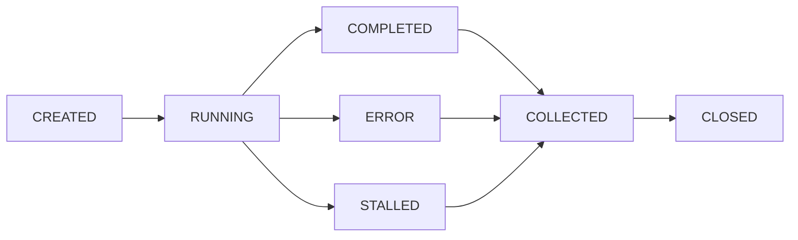

# Goal Parallel — First Principles Decomposition + Adversarial Review

Two pillars, one skill. **First Principles** governs generation — force AI to break
analogical reasoning and re-derive from fundamentals. **Adversarial Review** governs
verification — spawn attack agents to find every crack before users do. Together they
form a complete closed loop for high-quality parallel task execution.

## Core Philosophy

### First Principles Thinking (第一性原理)

Most AI coding uses analogical reasoning: find similar code in training data, adapt it.
This is fast but skips the most critical question: **is this really the right solution?**

Adding "从第一性原理出发" or activating first-principles mode forces the agent to:

1. Strip all assumptions and surface-level descriptions
2. Identify the fundamental facts / invariants / constraints
3. Re-derive the solution from those facts
4. Result: root-cause fixes, not surface patches

> Examples: A bug fix that rewrites the routing layer instead of patching a single
> scraper. A feature design that questions whether the requested feature is even the
> right abstraction.

### Adversarial Review (对抗式审查)

Standard verification is passive: run tests, check linter. But AI-written code has
hidden bugs that no test suite covers — because the test writer didn't imagine the
attack vector.

Adversarial review flips the mindset: **you always need an opposing force to tell you
you might be wrong.** Spawn agents whose explicit mission is to BREAK the system:

- Edge cases the human never thought of ("what if the timestamp is in the future?")
- Resource exhaustion ("what if 10,000 items arrive simultaneously?")
- Data poisoning ("what if HTML contains a 100MB nested table?")
- State corruption ("what if the cache says success but the DB says failure?")

Adversarial agents are read-only (explorers) — they find bugs, don't fix them.
Fixes go through workers or main agent after review.

### The Closed Loop

```
First Principles → Root-Cause Decomposition → Parallel Implementation → Adversarial Review → Fix → Verify
       ↑                                                                                           │
       └─────────────────────────── iterate if new issues found ──────────────────────────────────┘
```

## Trigger Logic

**Trigger this skill when ≥2 of these conditions are met:**

| # | Condition | Example |
|---|-----------|---------|
| 1 | ≥3 independent files OR ≥2 independent modules | "Fix auth.go, qa.go, and handler.go" |
| 2 | Both exploration and implementation needed | "Understand the codebase first, then add feature X" |
| 3 | ≥2 sub-tasks with no data dependency | "Add logging to module A and module B" |
| 4 | Multi-dimensional verification | "Build + test + lint after changes" |
| 5 | User explicitly requests parallel | "并行", "同时", "分头", "concurrent" |
| 6 | User invokes first principles | "从第一性原理出发", "first principles", "根本原因", "root cause" |
| 7 | User invokes adversarial review | "对抗式审查", "adversarial", "攻击测试", "break it" |

**Mandatory adversarial review trigger** (independent of ≥2 rule):
- After any non-trivial implementation completes (>3 files changed)
- When user says "审查", "review my code", "check for bugs", "有什么问题"
- When user is about to deploy/push to production (if signaled)

**Skip parallel** only when: single-file trivial change, strict sequential deps, ≤2 tool calls.

## Execution Protocol

### Phase 0 — First Principles Analysis (MANDATORY when condition 6 is met or task is non-trivial)

Before any decomposition, ask and answer in your own reasoning:

1. **What is the real problem?** (not the symptom, not the requested feature description)
2. **What are the fundamental facts / invariants / constraints?** (what MUST be true?)
3. **What assumptions are we making?** (explicitly list and challenge each one)
4. **If we started from scratch with only these facts, what would the solution look like?**

Then — and only then — proceed to decomposition. The decomposition MUST reflect the
first-principles analysis, not the surface file structure.

### Phase 1 — Assess & Plan

1. Evaluate trigger conditions.
2. If triggered: `create_goal("{one-line task summary, rooted in first principles if applicable}")`
3. Decompose into sub-tasks. For adversarial review tasks, include attack agents.
4. `update_plan` with one step per sub-agent.

### Phase 2 — Decompose & Assign

For each sub-task, declare:

- **Agent type**: `worker` (read-write), `explorer` (read-only), or `attacker` (read-only explorer with adversarial mission)
- **Write set**: exclusive file list for workers (no overlap)
- **Mission**: concrete task. For attackers: "Find edge cases, security holes, logic flaws, resource leaks, and state corruption vectors in {scope}"

Launch all independent sub-tasks in parallel. Queue excess beyond cap (12: ≤9 workers, ≤6 explorers/attackers).

### Phase 3 — Monitor, Collect, Recycle

Standard lifecycle loop (see `references/lifecycle.md` for full internals).

**Special rule for adversarial phases**: Collect ALL attack findings before starting any fixes. Do not fix while attackers are still running — new attacks may reveal that the fix is wrong.

### Phase 4 — Adversarial Review (MANDATORY for non-trivial changes)

After implementation completes:

1. **Generate attack vectors**: Based on the changed code, brainstorm ≥5 edge cases that could break it. Consider:
   - Temporal: wrong time, future time, zero time, overflow
   - Data: empty, null, massive, malformed, nested, recursive
   - Concurrency: race conditions, deadlocks, partial writes
   - Resource: memory, file descriptors, connections, disk
   - State: inconsistent cache, stale references, interrupted workflows
   - Input: injection, encoding, boundary values, type confusion

2. **Spawn attack agents**: One explorer per attack vector category. All read-only. All parallel.

3. **Collect findings**: Categorize as CRITICAL (will cause data loss/crash), HIGH (will cause incorrect behavior), MEDIUM (edge case), LOW (cosmetic).

4. **Fix loop**: For each finding:
   - Worker fixes the root cause (first principles — not just patching the symptom)
   - Re-run adversarial review on the fixed scope
   - Continue until attack agents find nothing new

### Phase 5 — Integrate & Verify

1. Merge all collected results. Resolve boundary conflicts.
2. Final adversarial pass: one attacker for the integrated whole.
3. Standard verification: build, test, lint.
4. `update_goal("complete")`
5. `update_plan` mark all complete.

## Adversarial Review Mode (Standalone)

When user requests standalone adversarial review (not tied to implementation):

```
"对抗式审查这个项目" / "review this codebase for bugs" / "adversarial audit"

→ create_goal("adversarial-review: {scope}")
→ Phase 0: First principles analysis of what could go wrong
→ Phase 1: Map attack surface (files, APIs, data flows, state machines)
→ Phase 2: Spawn attack agents by category (concurrency, data, state, resource, security)
→ Phase 3: Collect and categorize findings
→ Phase 4: Present prioritized report to user (do NOT auto-fix without approval)
→ Phase 5: After user approval, fix + re-verify
```

## Periodic Adversarial Audit Mode

When user requests periodic audit or it's been >2 weeks since last review:

```
"全面审查这个项目" / "periodic audit" / "定期审查"

→ Same as standalone adversarial review, but scope is the ENTIRE project
→ Include architecture review, dependency audit, and documentation-to-code consistency
→ This is the deepest review mode — expect it to find latent technical debt
```

## Sub-Agent Lifecycle



Liveness detection and recycle rules unchanged from `references/lifecycle.md`.

## Concurrency Model

```
Pool capacity: 12 total
├── Workers:    ≤9  (read-write, exclusive write sets)
├── Explorers:  ≤6  (read-only)
└── Attackers:  ≤6  (read-only, adversarial mission — counted as explorers)
Queue: unlimited, FIFO
```

## Write Set Isolation

Same rules as before. Attackers are read-only — no write-set conflict with anyone.

## Error Recovery

| Error | Strategy |
|-------|----------|
| Compile/syntax error | Retry same worker once; then main agent fixes |
| Logic error found by attacker | Worker fixes root cause, then re-attack |
| Agent STALLED | Close + re-queue |
| `spawn_agent` fails | Fall back to serial |
| Partial failure | Use successful results; re-assign failures |

## Anti-Patterns

- Serial execution when parallel conditions are met.
- Multiple workers sharing write-set files.
- `spawn_agent` immediately → `wait_agent`.
- Agent left open after COMPLETED/ERROR.
- **Skipping first-principles analysis and jumping to surface decomposition**.
- **Fixing adversarial findings as surface patches instead of root causes**.
- **Fixing while attackers are still running** (new attacks may invalidate the fix).
- Main agent duplicating worker/attacker work.

## Reference Docs

- `references/lifecycle.md` — Full lifecycle state machine, pool internals, edge cases
- `references/patterns.md` — Decomposition recipes + adversarial patterns
- `references/adversarial-review.md` — Attack vector taxonomy, multi-agent attack orchestration
