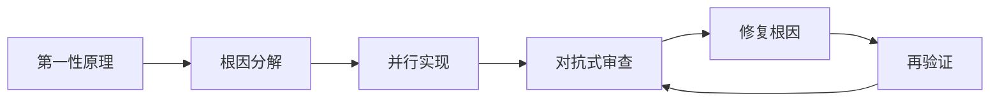

# Swarm — First Principles Decomposition + Adversarial Review

Two pillars, one skill. **First Principles** governs generation — force AI to break
analogical reasoning and re-derive from fundamentals. **Adversarial Review** governs
verification — spawn attack agents to find every crack before users do. Together they
form a complete closed loop for high-quality parallel task execution.

Optimized for Go backend projects (skb, dinghe, lma, go-bmjx pattern), with
specialized support for auth/security auditing and Feishu-integrated workflows.

## Core Philosophy

### First Principles Thinking (第一性原理)

Most AI coding uses analogical reasoning: find similar code in training data, adapt it.
This is fast but skips the most critical question: **is this really the right solution?**

Adding "从第一性原理出发" or activating first-principles mode forces the agent to:

1. Strip all assumptions and surface-level descriptions
2. Identify the fundamental facts / invariants / constraints
3. Re-derive the solution from those facts
4. Result: root-cause fixes, not surface patches

### Adversarial Review (对抗式审查)

Standard verification is passive: run tests, check linter. But AI-written code has
hidden bugs that no test suite covers — because the test writer didn't imagine the
attack vector.

Adversarial review flips the mindset: **you always need an opposing force to tell you
you might be wrong.** Spawn agents whose explicit mission is to BREAK the system.

### The Closed Loop



## Trigger Logic

**Trigger this skill when ≥2 of these conditions are met:**

| # | Condition | Example |
|---|-----------|---------|
| 1 | ≥3 independent files OR ≥2 independent modules | "Fix auth.go, qa.go, and handler.go" |
| 2 | Both exploration and implementation needed | "Understand the codebase first, then add feature X" |
| 3 | ≥2 sub-tasks with no data dependency | "Add logging to module A and module B" |
| 4 | Multi-dimensional verification | "Build + test + lint after changes" |
| 5 | User explicitly requests parallel | "并行", "同时", "分头", "concurrent" |
| 6 | User invokes first principles | "从第一性原理出发", "first principles", "根本原因", "root cause" |
| 7 | User invokes adversarial review | "对抗式审查", "adversarial", "攻击测试", "break it" |
| 8 | User invokes security audit | "安全审查", "越权", "权限漏洞", "security audit", "漏洞" |
| 9 | User invokes code review | "代码审查", "code review", "审计", "审查一下", "有什么问题" |

**Mandatory adversarial review trigger** (independent of ≥2 rule):
- After any non-trivial implementation completes (>3 files changed)
- When user says "审查", "review", "check for bugs", "有什么问题", "安全审查"
- When user mentions "越权", "权限", "auth", "认证", "登录"
- When user is about to deploy/push to production

## Execution Protocol

### Phase 0 — First Principles Analysis (MANDATORY for non-trivial tasks)

Before any decomposition, ask and answer:

1. **What is the real problem?** (not the symptom)
2. **What are the fundamental facts / invariants / constraints?**
3. **What assumptions are we making?** (challenge each one)
4. **If we started from scratch with only these facts, what would the solution be?**

### Phase 1 — Assess & Plan

Evaluate triggers → `create_goal` → decompose → `update_plan`.

For security/audit tasks, include dedicated auth attack vectors (see `references/auth-review.md`).

### Phase 2 — Decompose & Assign

| Agent type | Access | Purpose |
|-----------|--------|---------|
| `worker` | read-write | Implementation with exclusive write set |
| `explorer` | read-only | Code exploration, dependency analysis |
| `attacker` | read-only | Adversarial review, security audit, edge-case hunting |

### Phase 3 — Monitor, Collect, Recycle

Standard lifecycle loop (see `references/lifecycle.md`).

### Phase 4 — Adversarial Review

After implementation, systematically attack across these dimensions:

- **Auth & Permission** (Go-specific): middleware bypass, role escalation, JWT/Cookie manipulation, RBAC gaps, route-level access control
- **Temporal**: wrong/future/zero/overflow times
- **Data**: empty, null, massive, malformed, nested, recursive
- **Concurrency**: race conditions, deadlocks, goroutine leaks
- **Resource**: memory, file descriptors, connections, disk
- **State**: cache inconsistency, stale references, interrupted workflows
- **Input**: injection, encoding, boundary values, type confusion

See `references/adversarial-review.md` for full taxonomy and
`references/auth-review.md` for Go backend auth-specific attack patterns.

### Phase 5 — Integrate & Verify

1. Merge results, resolve conflicts
2. Final adversarial pass on integrated whole
3. Build, test, lint
4. `update_goal("complete")` + `update_plan`

## Adversarial Review Mode (Standalone)

```
"安全审查这个项目" / "审查一下 auth 模块" / "code review"

→ create_goal("adversarial-review: {scope}")
→ Phase 0: First principles analysis of what could go wrong
→ Map attack surface (middleware chain, auth flow, permission matrix, API routes)
→ Spawn attackers: auth, concurrency, data, state, resource, security
→ Collect + categorize (CRITICAL/HIGH/MEDIUM/LOW)
→ Present prioritized report (do NOT auto-fix without user approval)
→ After approval: fix + re-verify
```

## Auth/Permission Security Audit Mode

When user says "越权", "权限漏洞", "安全审计", "auth audit":

→ Spawn dedicated auth attackers covering:
  - Route-level access control (is every route properly gated?)
  - Role escalation (can low-privilege users access admin endpoints?)
  - JWT/Cookie manipulation (expiry, signing, domain scope)
  - Middleware bypass (order-dependent middleware chains)
  - RBAC consistency (menu config vs code enforcement)

See `references/auth-review.md` for detailed audit checklist and Go patterns.

## Concurrency Model

```
Pool: 12 agents max
├── Workers:   ≤9  (read-write, exclusive write sets)
├── Explorers: ≤6  (read-only)
└── Attackers: ≤6  (read-only, adversarial mission)
Queue: unlimited FIFO
```

## Error Recovery

| Error | Strategy |
|-------|----------|
| Compile/syntax error | Retry once; then main agent fixes |
| Logic error from attacker | Worker fixes root cause → re-attack |
| Agent STALLED | Close + re-queue |
| `spawn_agent` fails | Fall back to serial |
| Partial failure | Use successes; re-assign failures |

## Anti-Patterns

- Serial execution when parallel conditions are met
- Multiple workers sharing write-set files
- `spawn_agent` → immediate `wait_agent`
- Agent left open after COMPLETED/ERROR
- Skipping first-principles analysis → surface decomposition
- Fixing adversarial findings as surface patches instead of root causes
- Fixing while attackers are still running
- **Overlooking auth in adversarial review** for Go backend projects
- Main agent duplicating worker/attacker work

## Reference Docs

- `references/lifecycle.md` — Lifecycle state machine, pool internals
- `references/patterns.md` — 11 decomposition patterns + anti-patterns
- `references/adversarial-review.md` — Attack vector taxonomy
- `references/auth-review.md` — Go backend auth/security audit (JWT, RBAC, middleware)
