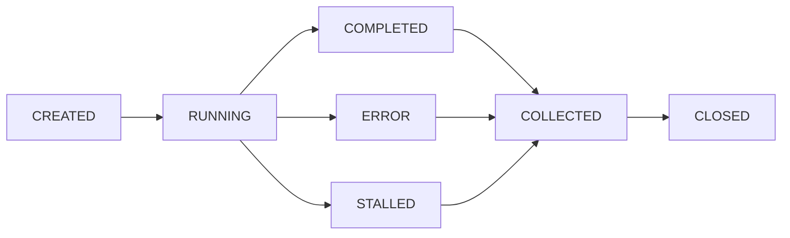

# Goal Parallel — Parallel Task Decomposition with Sub-Agent Lifecycle

Decompose complex tasks into independent sub-tasks, spawn parallel worker/explorer agents,
monitor liveness, collect results, integrate, and auto-recycle all agents. No manual
lifecycle management needed.

## Trigger Logic

Before taking any action on a user task, evaluate these 5 conditions.
**Trigger this skill when ≥2 conditions are met:**

| # | Condition | Example |
|---|-----------|---------|
| 1 | ≥3 independent files OR ≥2 independent modules | "Fix auth.go, qa.go, and handler.go" |
| 2 | Both exploration and implementation needed | "Understand the codebase first, then add feature X" |
| 3 | ≥2 sub-tasks with no data dependency | "Add logging to module A and module B" |
| 4 | Multi-dimensional verification | "Build + test + lint after changes" |
| 5 | User explicitly requests parallel | "并行", "同时", "分头", "concurrent" |

**Skip parallel and execute serially** when: single-file trivial change, sub-tasks
have strict sequential dependencies, or total work is ≤2 tool calls.

## Execution Protocol

### Phase 1 — Assess & Plan

1. Evaluate trigger conditions against the user's request.
2. If triggered: `create_goal("{one-line task summary}")`
3. Decompose into independent sub-tasks using codegraph (≤2 calls) to understand scope.
4. `update_plan` with one step per sub-agent, visible to user.

### Phase 2 — Decompose & Assign

For each sub-task, declare:

- **Agent type**: `worker` (read-write) or `explorer` (read-only)
- **Write set**: exclusive file list (workers only; no overlap between any two workers)
- **Task description**: concrete, bounded, self-contained

Launch all independent sub-tasks in parallel via `spawn_agent`. Queue excess beyond
concurrency cap (12 total: ≤9 workers, ≤6 explorers). Each queued task waits for a
free slot.

### Phase 3 — Monitor, Collect, Recycle (single loop)

```
while any agent is RUNNING or queue is non-empty:
    for each COMPLETED agent:
        wait_agent → extract result
        close_agent IMMEDIATELY   ← never leave completed agents open

    for each RUNNING agent (liveness check):
        has new output since last poll? → reset stall counter
        no output for 3 consecutive polls? → STALLED
            close_agent
            re-queue sub-task (new agent)

    while active < 12 and queue non-empty:
        spawn_agent(queue.pop())

    do integration-prep work (non-conflicting with running agents)
```

**Critical rules**:
- Never `spawn_agent` then immediately `wait_agent` — spawn ALL first, then collect.
- Never leave a COMPLETED or ERROR agent open — close immediately after collecting.
- When goal reaches `complete` or `blocked`: batch `close_agent` ALL remaining agents.
- When session/task ends: batch `close_agent` ALL remaining agents.

### Phase 4 — Integrate & Verify

1. Merge all collected results. Resolve boundary conflicts.
2. Verify: `go build ./...`, `go test ./...`, linter as available.
3. `update_goal("complete")`
4. `update_plan` mark all steps complete.

## Sub-Agent Lifecycle



**Liveness detection** (no fixed timeouts — different tasks take different time):

- Every poll round, check each RUNNING agent for new output (tool calls, text).
- New output → agent is alive, reset silent-round counter.
- 3 consecutive silent rounds with zero output → STALLED → close + re-queue.
- Long-running agents that keep producing output are NEVER killed by timeout.

**Recycle trigger checklist**:

| Condition | Action |
|-----------|--------|
| Agent COMPLETED, result collected | `close_agent` now |
| Agent ERROR | `close_agent`, log cause |
| Agent STALLED (3 silent rounds) | `close_agent`, re-queue task |
| Goal complete/blocked | batch `close_agent` all |
| Task/session end | batch `close_agent` all |

## Concurrency Model

```
Pool capacity: 12 total
├── Workers:  ≤9  (read-write, exclusive write sets)
└── Explorers: ≤6  (read-only, no write conflicts)
Queue: unlimited, FIFO, auto-dequeue when slot frees
```

## Write Set Isolation (Safety)

Before spawning workers, declare each worker's exclusive file list.
Two workers MUST NOT share any file in their write sets.

```
Worker-1 write set: ["pkg/logic/qa.go", "pkg/entity/qa.go"]
Worker-2 write set: ["pkg/middleware/auth.go"]
✓ No overlap — safe to parallelize
```

Explorers are read-only and can explore any files without conflict.

## Error Recovery

| Error | Strategy |
|-------|----------|
| Compile/syntax error from worker | Retry same worker once; if still failing, main agent fixes |
| Logic error from worker | Main agent fixes directly (worker doesn't retry logic) |
| Agent STALLED | Close + re-queue as new sub-task |
| `spawn_agent` fails | Fall back to serial (main agent executes) |
| Partial worker failure | Use successful workers' results; re-assign failed sub-tasks |

## Anti-Patterns (NEVER)

- Serial execution when ≥2 parallel triggers are met.
- Multiple workers sharing write-set files.
- `spawn_agent` immediately followed by `wait_agent` (blocks parallelism).
- Agent COMPLETED/ERROR left open (resource leak).
- Agent exception silently ignored.
- Main agent duplicating work already done by a worker.

## Reference Docs

Load these when deeper guidance is needed:

- `references/lifecycle.md` — Full lifecycle state machine, pool internals, edge cases
- `references/patterns.md` — Decomposition recipes for common task shapes
