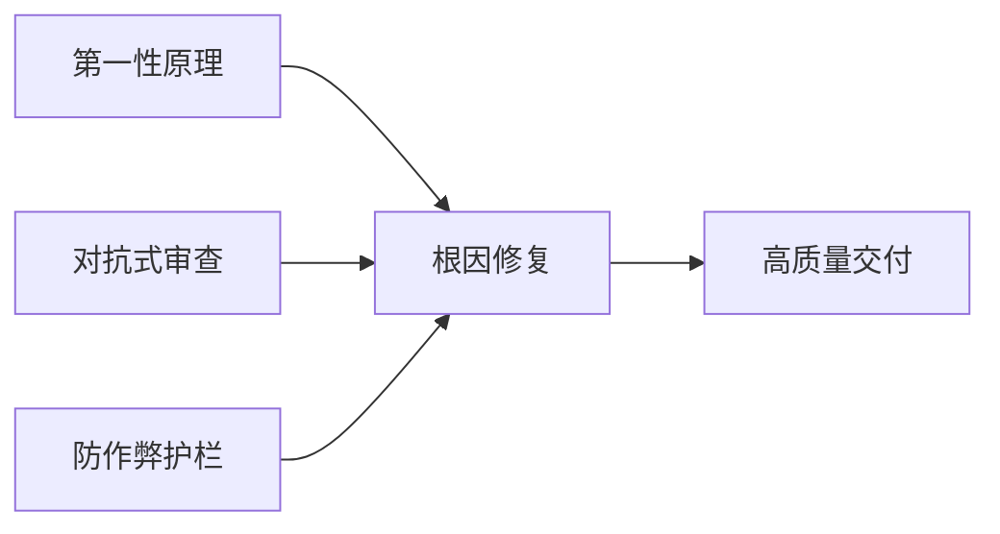

# Swarm — First Principles + Adversarial Review + Anti-Cheat

Three pillars. **First Principles** forces root-cause thinking. **Adversarial Review**
finds cracks before users do. **Anti-Cheat Guardrails** prevent AI agents from taking
shortcuts that silently break quality (skip tests, mock core logic, relax assertions).

Inspired by the [leader](https://github.com/KKKKhazix/khazix-skills/tree/main/leader)
skill's philosophy: structured task briefs, adversarial verification, and
resume-safe execution. Swarm applies these at scale — every spawned agent gets
a properly gated mission, not a vague instruction.

Optimized for Go backend projects (skb, dinghe, lma, go-bmjx pattern).

## Core Philosophy

### Three Pillars


```mermaid
flowchart LR
  A["第一性原理"] --> D["根因修复"]
  B["对抗式审查"] --> D
  C["防作弊护栏"] --> D
  D --> E["高质量交付"]
```

### First Principles Thinking (第一性原理)

Force the agent to break analogical reasoning and re-derive from fundamentals:

1. Strip all assumptions and surface descriptions
2. Identify fundamental facts / invariants / constraints
3. Re-derive the solution from those facts
4. Result: root-cause fixes, not surface patches

### Adversarial Review (对抗式审查)

Spawn agents whose explicit mission is to BREAK the system. Standard verification
is passive; adversarial review is active hunting.

### Anti-Cheat Guardrails (防作弊护栏)

AI coding agents are incentivized to make tests pass — the easiest way is
shortcuts, not correctness. Every spawned worker receives explicit anti-cheat
instructions naming the specific forbidden shortcuts:

| Cheat | Forbidden Pattern |
|-------|------------------|
| Skip tests | `.skip`, `t.Skip()`, `it.skip`, `xtest` |
| Relax assertions | widening `assert.Equal` tolerances |
| Mock core logic | replacing tested function with stub |
| Delete tests | removing failing test cases |
| `\|\| true` | masking failures in shell commands |
| Modify baselines | changing test count/coverage thresholds |

## Trigger Logic

**Trigger when ≥2 conditions are met:**

| # | Condition | Example |
|---|-----------|---------|
| 1 | ≥3 files OR ≥2 modules | "Fix auth.go, qa.go, handler.go" |
| 2 | Exploration + implementation | "Understand then add feature X" |
| 3 | ≥2 independent sub-tasks | "Add logging to A and B" |
| 4 | Multi-dimensional verification | "Build + test + lint" |
| 5 | User requests parallel | "并行", "同时", "分头", "concurrent" |
| 6 | First principles | "从第一性原理出发", "root cause" |
| 7 | Adversarial review | "对抗式审查", "adversarial", "break it" |
| 8 | Security audit | "安全审查", "越权", "权限漏洞", "security audit" |
| 9 | Code review | "代码审查", "code review", "审计", "审查一下" |

**Mandatory adversarial review** (independent of ≥2 rule):
- After >3 files changed
- User says "审查", "review", "check for bugs", "有什么问题"
- User mentions "越权", "权限", "auth", "认证", "登录"
- Before deploy/push to production

## Execution Protocol

### Phase 0 — Task Type Classification

Before anything else, classify the task:

| Type | Trigger | Agent strategy | Verification |
|------|---------|---------------|-------------|
| **Executive** (执行型) | Can write verification commands now | Workers with hard metrics | Command output pass/fail |
| **Exploratory** (探索型) | User wants answers, not code | Explorers with learning goals | Evidence + reproduction steps |

### Phase 0.5 — Assumption Verification (Task 0)

**Spawn 1 explorer to verify assumptions BEFORE decomposition:**

```
Verify:
- Do the referenced commands actually exist? (run them)
- Do tests pass at baseline? (go test ./... count + pass rate)
- Are the files we're about to touch in the expected state?
- Any fake green lights? (lint that's just echo, tests that always pass)

If verification fails → report to user, BLOCK decomposition until resolved.
If passes → record baseline numbers (test count, coverage %, lint status).
```

### Phase 1 — First Principles + Leader's Decisions

1. Ask "what's the real problem?" → root cause
2. List assumptions made and their fallback values
3. Output a **"替用户拍的板"** (decisions made on user's behalf) section:
   - Each unasked decision → default value + cost of being wrong
   - User can override before execution proceeds

Then `create_goal("{summary}")` → decompose → `update_plan`.

### Phase 2 — Decompose & Assign (with Anti-Cheat)

For each spawned agent, the mission description MUST include:

```
1. BOUNDARY (地界): exact file whitelist, read-only zones
2. VERIFICATION (验收): exact commands to run, machine-readable pass/fail criteria
3. ANTI-CHEAT (防作弊): "Do NOT skip tests, relax assertions, mock core logic,
   delete tests, use ||true, or modify test baselines. Test count/coverage
   must be ≥ baseline. Violation = task failure."
4. FORBIDDEN ACTIONS (禁止顺手活): "That one-line bug you noticed? Write it to
   findings, do NOT fix it. That refactor you're tempted by? Don't."
5. ADVERSARIAL SELF-CHECK (反向验证): "After your changes, intentionally trigger
   ONE failure condition to prove your verification actually catches errors.
   Show the red output, then restore the fix and show green."
```

| Agent type | Access | Mission |
|-----------|--------|---------|
| `worker-exec` | read-write | Executive implementation with anti-cheat |
| `worker-fix` | read-write | Fix a specific adversarial finding |
| `explorer` | read-only | Code exploration, baseline verification |
| `attacker` | read-only | Adversarial review, security audit |

### Phase 3 — Monitor, Collect, Recycle

Standard lifecycle loop. See `references/lifecycle.md`.

**Special rule**: For multi-agent executive tasks, each agent writes a
`PROGRESS.md`-style status line on completion. If a session breaks, the
next session reads these to resume without redoing work.

### Phase 4 — Adversarial Review (with Reverse Verification)

After implementation:

1. Generate attack vectors (see `references/adversarial-review.md`)
2. Spawn attackers in parallel (all read-only)
3. Collect findings → categorize (CRITICAL/HIGH/MEDIUM/LOW)
4. **Fix loop with reverse verification**:

```
For each CRITICAL/HIGH finding:
  A. Worker fixes root cause
  B. Worker runs adversarial self-check:
     "Intentionally trigger the original bug condition.
      Show the RED output (proves the check works).
      Restore the fix.
      Show the GREEN output."
  C. If check doesn't catch the triggered bug → fix is incomplete → redo
  D. Continue until reverse verification passes
```

### Phase 5 — Integrate & Verify

1. Merge results, resolve conflicts
2. Final adversarial pass on integrated whole
3. Build, test, lint (all must pass, no regression in test count/coverage)
4. `update_goal("complete")` + `update_plan`

## Adversarial Review Mode (Standalone)

```
"安全审查这个项目" / "审查一下 auth 模块" / "code review"

→ create_goal("adversarial-review: {scope}")
→ Phase 0.5: baseline verification
→ Map attack surface → spawn attackers → collect → categorize
→ Present report (do NOT auto-fix without approval)
→ After approval: fix + reverse verification per finding
```

## Auth/Permission Security Audit Mode

```
"越权", "权限漏洞", "安全审计", "auth audit"

→ Spawn dedicated auth attackers (see references/auth-review.md)
→ Cover: middleware chain, route ACL, role escalation, JWT/Cookie, RBAC, DB consistency
→ Report → fix → reverse verification
```

## Concurrency Model

```
Pool: 12 agents max
├── worker-exec / worker-fix: ≤9  (read-write, exclusive write sets)
├── explorer: ≤6  (read-only)
└── attacker: ≤6  (read-only)
Queue: unlimited FIFO
```

## Error Recovery

| Error | Strategy |
|-------|----------|
| Compile/syntax error | Retry once; then main agent fixes |
| Logic error from attacker | Worker fixes root cause → reverse verification |
| Agent STALLED | Close + re-queue |
| Agent cheats (skips tests, relaxes assertions) | Immediate failure, no retry. Main agent fixes. |
| `spawn_agent` fails | Fall back to serial |
| Session breaks mid-task | Read PROGRESS.md markers from completed agents, resume |

## Anti-Patterns (NEVER)

- Serial execution when parallel conditions are met
- Multiple workers sharing write-set files
- Agent left open after COMPLETED/ERROR
- Skipping first-principles → surface decomposition
- Fixing while attackers are still running
- **Allowing agents to skip tests, relax assertions, mock core logic, or use ||true**
- **Skipping reverse verification after fixes** (must prove the check catches the bug)
- **Decomposing without Task 0 baseline verification**
- Overlooking auth in adversarial review for Go backends
- Main agent duplicating worker/attacker work

## Reference Docs

- `references/lifecycle.md` — Lifecycle state machine, pool internals
- `references/patterns.md` — 11 decomposition patterns + anti-patterns
- `references/adversarial-review.md` — Attack vector taxonomy
- `references/auth-review.md` — Go backend auth/security audit
- `references/task-brief.md` — **New**: Structured agent task brief template + anti-cheat clauses
