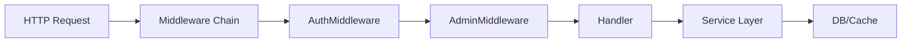

# Auth & Permission Security Audit — Go Backend

## Why This Exists

Analysis of 48 Codex sessions over 30 days revealed that auth/security review is the
single most frequent task pattern:
- "用户反馈有越权漏洞 普通用户也能上传文档到公共知识库"
- "你是安全漏洞挖掘专家。重新审查 overlay 登录系统的全部新代码"
- "你是资深Go代码审查专家。对以下文件进行彻底的代码质量审查"
- "Cookie 7天过期修改" / "JWT认证" / "SSO登录"

This reference provides Go-backend-specific attack patterns that generic adversarial
review tools would miss.

## Attack Surface Mapping

For any Go backend project (skb, dinghe, lma, go-bmjx pattern), map these surfaces
before spawning attackers:



### 1. Middleware Chain Audit

```go
// DANGER: middleware order matters!
// AuthMiddleware must come BEFORE AdminMiddleware
r.Use(middleware.AuthMiddleware())   // ← must be first
r.Use(middleware.AdminMiddleware())  // ← must be second
```

**Attack vectors:**

| Vector | Trigger | Go-specific check |
|--------|---------|-------------------|
| Middleware ordering | What if AdminMiddleware fires before Auth? | Check `r.Use()` order in router.go |
| Skipped middleware | Does any route bypass the chain? | Search for `r.Group()` without middleware |
| Abort miss | Does middleware call `c.Abort()` on failure? | Check all `if err != nil` branches |
| Next miss | Does middleware call `c.Next()` too early? | Look for `c.Next()` before auth check |
| Recovery miss | Does panic recovery skip middleware? | Check `gin.Recovery()` placement |

### 2. Role/Permission Escalation

```go
// Common Go pattern — check for these flaws:
func AdminMiddleware() gin.HandlerFunc {
    return func(c *gin.Context) {
        u, _ := c.Get("user")  // ← BUG: type assertion without ok check
        user := u.(*entity.User)
        if user.Role != entity.RoleAdmin {  // ← is RoleAdmin the right constant?
            c.Abort()
        }
    }
}
```

**Attack vectors:**

| Vector | Trigger | Go-specific check |
|--------|---------|-------------------|
| Nil user | `c.Get("user")` returns nil | Check `ok` in type assertion |
| Default role | New users get RoleAdmin by default? | Check `entity.User{}` zero value |
| Role constant mismatch | `RoleAdmin=1` but middleware checks `!=2` | Search for role constant usages |
| String comparison | Role stored as string, compared to int | Check role field type everywhere |
| Context poisoning | Can user modify `c.Set("user", admin)`? | Check for user-controllable context keys |

### 3. Route-Level Access Control

```go
// BAD: blanket admin middleware
adm := r.Group("/adm")
adm.Use(AdminMiddleware())  // ← ALL /adm/* routes are admin-only
adm.GET("/public-notice", handler)  // ← but this should be public!

// GOOD: per-route control
adm.GET("/admin-only", AdminMiddleware(), handler)
adm.GET("/public-notice", handler)  // ← explicitly public
```

**Attack vectors:**

| Vector | Trigger | Go-specific check |
|--------|---------|-------------------|
| Blanket middleware | Are all `/adm/*` routes admin-only? | Audit every route in the group |
| Missing public routes | Any `/adm/` route that users should access? | Check for `official_notice`, `download` |
| HTTP method bypass | GET requires admin but POST doesn't? | Check middleware per HTTP method |
| Wildcard collision | `/adm/*filepath` matches everything | Check gin wildcard patterns |

### 4. JWT / Cookie Security

```go
// Audit these patterns:
c.SetCookie("token", val, 86400*7, "/", domain, true, true)
//  name     value   maxAge  path  domain  secure  httpOnly
```

**Attack vectors:**

| Vector | Trigger | Go-specific check |
|--------|---------|-------------------|
| Expiry too long | `maxAge` = 30 days? | Check `jwtExpireDuration` |
| Domain too wide | `.example.com` instead of `api.example.com` | Check `domain` param |
| Secure=false in prod | HTTP-only cookies in HTTPS | Check last `true` in `SetCookie` |
| No HttpOnly | XSS can steal token | Check second-to-last `true` |
| Path too wide | `"/"` instead of `"/api/"` | Check `path` param |
| Hardcoded secret | `[]byte("secret")` in source | Search for `jwtSecret` assignments |
| No rotation | Same secret for 2+ years | Check git blame on secret definition |

### 5. Feishu/DingTalk SSO Integration

Common in skb/dinghe patterns:

| Vector | Trigger | Go-specific check |
|--------|---------|-------------------|
| Code replay | Reuse same OAuth code twice | Check code consumption (one-time use) |
| State parameter | CSRF on OAuth redirect | Check `state` parameter validation |
| User mapping | SSO user mapped to wrong local user | Check union_id → user_id mapping |
| Token leakage | Access token logged or returned in API | Search for `log.*token` patterns |
| Session fixation | Login doesn't rotate session | Check session ID change after login |

### 6. Database-Level Permission

```go
// DANGER: RBAC enforced in code but not in DB
// What if someone directly modifies app_role.menu_ids?
db.Exec("UPDATE app_role SET menu_ids = ? WHERE role_id = ?", ...)
```

| Vector | Trigger | Go-specific check |
|--------|---------|-------------------|
| Code-only enforcement | No DB-level constraints | Check for CHECK constraints |
| Direct DB access | Can bypass Go middleware | Audit DB user permissions |
| Menu config drift | Code role != DB role | Compare entity.RoleAdmin vs DB entries |
| Soft delete bypass | Deleted user can still auth? | Check `deleted_at IS NULL` in queries |

## Audit Execution Pattern

When user requests auth/security audit:

```
Phase 0 — First Principles:
  What is the trust boundary? Who can access what?
  What assumptions does the auth system make?

Phase 1 — Surface Map (main agent or single explorer):
  List all middleware, all route groups, all role constants, all JWT config

Phase 2 — Parallel Attack (spawn ≥3 attackers):
  Attacker-1: Middleware chain + route access control
  Attacker-2: JWT/Cookie/Session security
  Attacker-3: Role/permission escalation + DB consistency

Phase 3 — Report:
  CRITICAL: Data breach, privilege escalation, auth bypass
  HIGH: Security misconfiguration, weak crypto
  MEDIUM: Defense-in-depth gaps
  LOW: Code style issues in auth code

Phase 4 — Fix + Re-attack
```

## Go-Specific Checklist

When auditing Go auth code, systematically check:

```
□ gin.Context.Get() — always check ok in type assertion
□ gin.Context.Abort() — called on ALL error paths
□ gin.Context.Next() — not called before auth check
□ c.SetCookie() — secure=true, httpOnly=true in production
□ jwt.Parse() — verify signing method (not "none")
□ middleware order — auth → admin → handler (never reversed)
□ route groups — verify every route's permission individually
□ role constants — verify values match across code and DB
□ error messages — don't leak auth details to client
□ defer/recover — doesn't skip auth middleware
```
